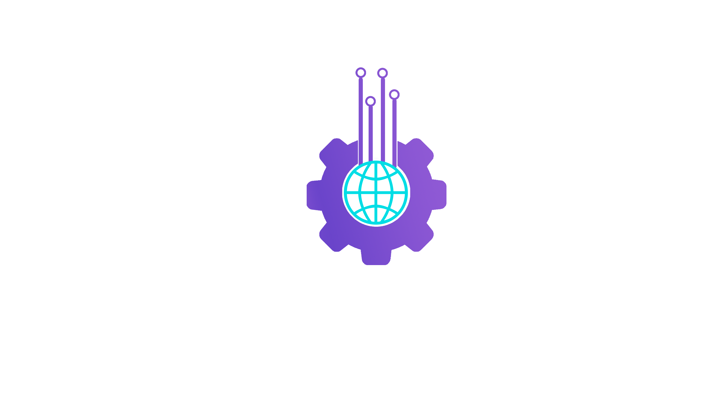

# Portfolio

  
  
  
  <h2 align="center">AMODI</h2>

  

    Personal Portfolio
     
    <a href="#about-the-project"><strong>Explore the docs »</strong></a>
     
     
    <a href="">View Demo</a>
    ·
    <a href="https://github.com/Moe-alamodi/portfolio_website/issues">Report Bug</a>
    ·
    <a href="https://github.com/Moe-alamodi/portfolio_website/issues">Request Feature</a>
  

<!-- ABOUT THE PROJECT -->

